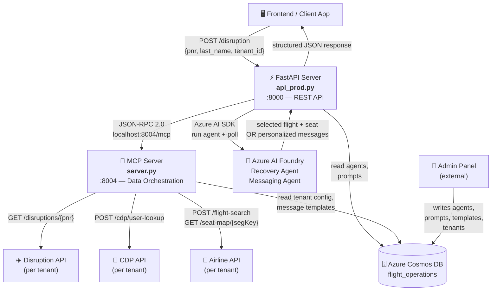
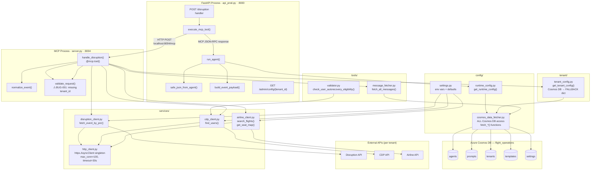
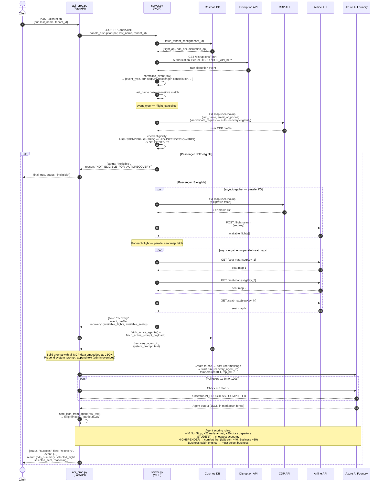
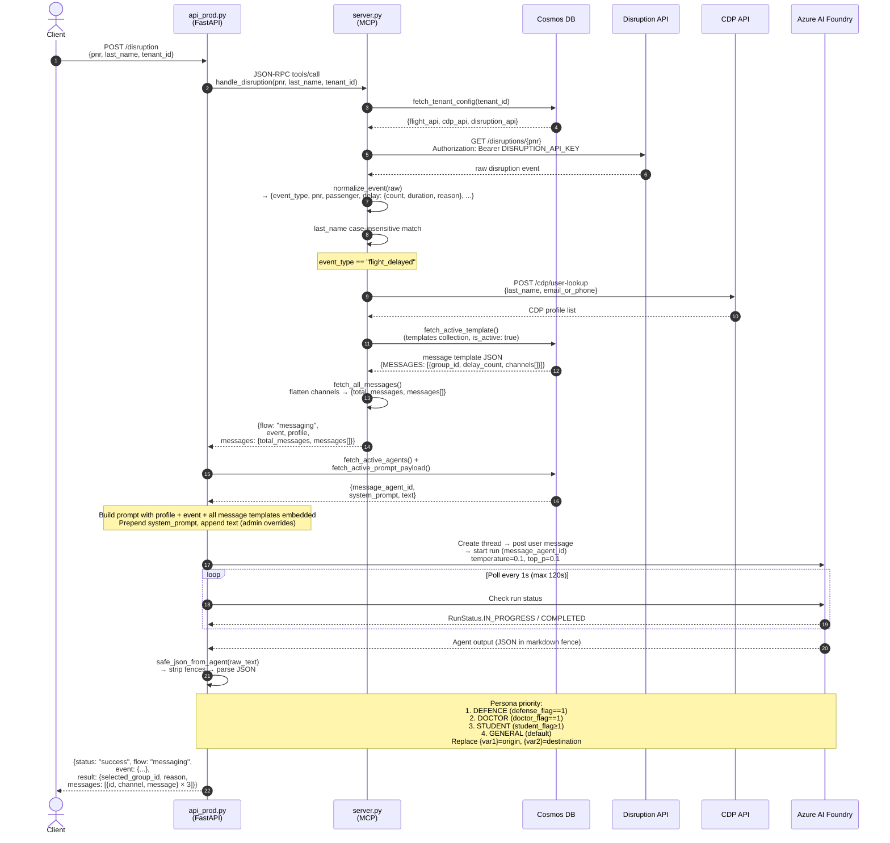
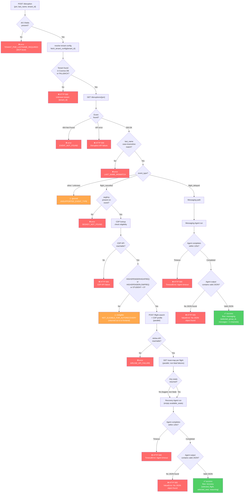
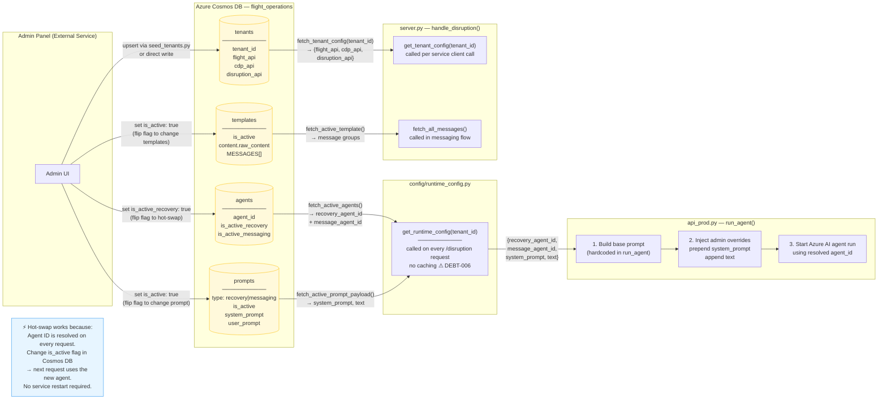
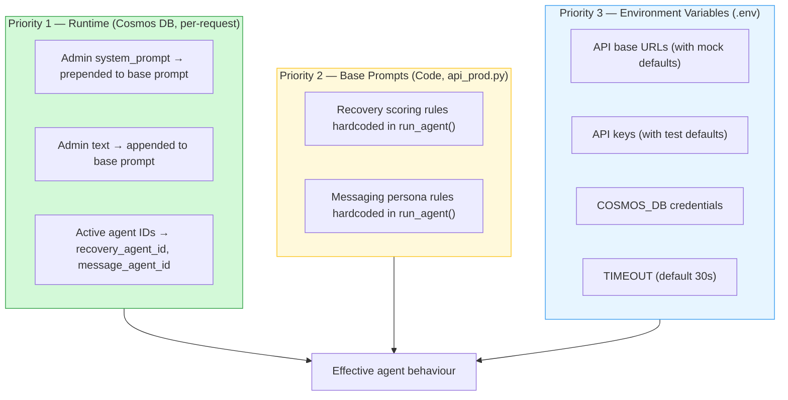
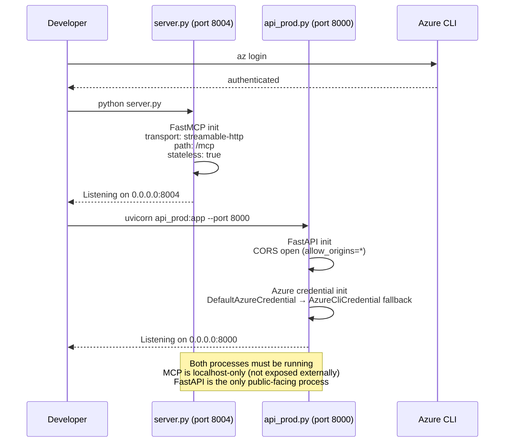

# Architecture & Flow Diagrams — prodDisruption

**Excalidraw (interactive, shareable):** https://excalidraw.com/#json=5XivTgCo7aPz01NUBRe9U,Wo7f9Dag1owT5gMlGE0sIw

Six diagrams, two levels of detail:
- **[1–2]** System architecture — stakeholder overview + full technical map
- **[3–4]** Request flows — Recovery (cancelled) + Messaging (delayed)
- **[5]** Error & edge-case paths — all non-success branches
- **[6]** Admin config flow — how the admin panel hot-swaps agents

---

## 1. High-Level System Architecture (Stakeholder View)

> What the system does and which external systems it touches.

---

## 2. Detailed Technical Architecture (Developer View)

> Every Python module, its role, and its dependencies.

---

## 3. Recovery Flow — Flight Cancelled

> Step-by-step sequence for `event_type == "flight_cancelled"`. Only eligible passengers (HIGHSPENDER or STUDENT) proceed.

---

## 4. Messaging Flow — Flight Delayed

> Step-by-step sequence for `event_type == "flight_delayed"`. All passengers receive personalized messages. No eligibility gate.

---

## 5. Error & Edge-Case Paths

> Every non-success branch from the entry point through both flows.

**Legend:**
- 🔴 `error` — hard failure returned to the client
- 🟠 `ineligible` / `ignored` — soft non-error outcomes, handled by frontend
- 🟢 `success` — normal completion

---

## 6. Admin Config Flow — Agent & Prompt Hot-Swap

> How the admin panel writes to Cosmos DB, and how this service reads it on every request without a restart.

---

## Configuration Priority Layers

> How different config sources stack up — highest priority wins.

---

## Process Startup Sequence

