# TO-BE: Enterprise Azure Production Architecture — prodDisruption

> **Future State (TO-BE).** For the current AS-IS architecture see `docs/diagrams.md`.

**Version:** 2.0 — Enterprise SaaS Platform  
**Target scale:** 1M+ disruption events/day · Multi-region active-active · Per-tenant AI agent isolation  
**Deployment:** Azure Container Apps (private VNET) + Azure Static Web Apps

---

## Architecture Principles

| Principle | Implementation |
|---|---|
| Async-first, non-blocking | Service Bus queue + Worker Pool (no synchronous AI calls in hot path) |
| Idempotent by default | Redis key `{tenant}:{pnr}:{sha256(request)}` with TTL prevents duplicate jobs |
| No localhost coupling | MCP Gateway is a private Container App, not a co-located process |
| Two-pass AI for recovery | AI selects flight first, seat map fetched only for that flight, then AI selects seat |
| Zero-trust security | Managed Identity everywhere, Key Vault references, private endpoints |
| Per-tenant isolation | Cosmos DB partition key = `tenant_id`, per-tenant AI agents, Redis key namespacing |
| Full observability | Correlation IDs propagated end-to-end, AI token metrics, latency histograms |
| Resilient queuing | Service Bus DLQ + configurable retry with exponential backoff |

---

## Platform Component Registry

| Container App | Ingress | Min/Max Replicas | Role |
|---|---|---|---|
| `api-orchestrator` | External (via APIM) | 2 / 20 | REST API, async dispatch, job status |
| `mcp-gateway` | Internal only | 2 / 10 | Data orchestration, external API fan-out |
| `worker-pool` | Internal + SB trigger | 1 / 50 | AI execution, Service Bus consumers |
| `api-admin` | External (via APIM) | 1 / 5 | Tenant/agent/prompt/config management |
| `event-processor` | External webhook (via APIM) | 1 / 10 | Airline webhook intake, proactive disruption |
| Frontend | Public (Static Web Apps) | N/A | Passenger SPA + Admin SPA |

---

## 1. High-Level Enterprise Architecture

> Full platform from public internet through edge, orchestration, async processing, AI, data, and observability.

```mermaid
flowchart TB
    classDef apim fill:#0078d4,stroke:#005a9e,color:#fff
    classDef aca fill:#3b82f6,stroke:#1d4ed8,color:#fff
    classDef data fill:#0f766e,stroke:#0d5c55,color:#fff
    classDef ai fill:#7c3aed,stroke:#5b21b6,color:#fff
    classDef sec fill:#b45309,stroke:#7c2d12,color:#fff
    classDef obs fill:#15803d,stroke:#14532d,color:#fff
    classDef saas fill:#1e3a5f,stroke:#0f2240,color:#fff
    classDef ext fill:#6b7280,stroke:#4b5563,color:#fff
    classDef edge fill:#0ea5e9,stroke:#0284c7,color:#fff

    subgraph INTERNET["PUBLIC INTERNET"]
        PASSENGERS["Airline Passengers"]
        ADMINS["Airline Admins"]
        AIRLINE_WH["Airline Webhook Sources"]
        MARKETPLACE["Azure Marketplace"]
    end

    subgraph EDGE_LAYER["AZURE EDGE"]
        AFD["Azure Front Door\n+ WAF Policy"]
        APIM["Azure API Management\nJWT Auth · Rate Limiting · Tenant Injection · Trace ID Propagation"]
        SWA["Azure Static Web Apps\nPassenger SPA + Admin SPA"]
    end

    subgraph ACA_ENV["AZURE CONTAINER APPS ENVIRONMENT (Private VNET)"]
        direction TB
        subgraph PUBLIC_ACA["Externally Reachable via APIM"]
            ORCH["api-orchestrator\n(FastAPI Orchestrator)"]
            ADMIN_CA["api-admin\n(Admin Panel Backend)"]
            EVTP["event-processor\n(SegKey Event Processor)"]
        end
        subgraph INTERNAL_ACA["Internal-Only (no public ingress)"]
            MCP_CA["mcp-gateway\n(MCP Gateway)"]
            WORKER_CA["worker-pool\n(Worker Services)"]
        end
    end

    subgraph MESSAGING["AZURE MESSAGING & CACHE"]
        SB["Azure Service Bus\ndisruption-requests · dead-letter · retry"]
        REDIS["Azure Cache for Redis\nIdempotency · PNR Cache · Seat Maps · Job State"]
    end

    subgraph DB_LAYER["AZURE DATA LAYER"]
        COSMOS["Azure Cosmos DB\nflight_operations\n(partitioned by tenant_id)"]
    end

    subgraph AI_LAYER["AZURE AI PLATFORM"]
        AIF["Azure AI Foundry\nGPT-5.1 · Recovery Agent · Messaging Agent\n(per-tenant agent registry)"]
    end

    subgraph EXT_APIS["TENANT EXTERNAL APIS (per tenant)"]
        DIS_EXT["Disruption APIs"]
        CDP_EXT["CDP APIs"]
        ALN_EXT["Airline Flight APIs"]
    end

    subgraph SAAS_CP["AZURE SAAS ACCELERATOR (Control Plane)"]
        ONBOARD["Tenant Onboarding\n& Provisioning"]
        BILLING["Billing &\nSubscription Lifecycle"]
    end

    subgraph OBS["OBSERVABILITY"]
        APPINS["Azure Application Insights\nDistributed Tracing · AI Telemetry"]
        MONITOR["Azure Monitor\nMetrics · Alerts · Dashboards"]
        LAW["Log Analytics Workspace\nCentralized Logs"]
    end

    subgraph SEC["SECURITY"]
        KV["Azure Key Vault\nSecrets · Certs · Keys"]
        MI["Managed Identity\n(all Container Apps)"]
        ACR["Azure Container Registry\nPrivate image repository"]
    end

    PASSENGERS --> AFD
    ADMINS --> AFD
    AIRLINE_WH --> AFD
    MARKETPLACE --> ONBOARD

    AFD --> SWA
    AFD --> APIM
    APIM --> ORCH
    APIM --> ADMIN_CA
    APIM --> EVTP

    ORCH --> SB
    ORCH --> REDIS
    ORCH --> COSMOS
    EVTP --> SB

    WORKER_CA --> SB
    WORKER_CA --> MCP_CA
    WORKER_CA --> AIF
    WORKER_CA --> REDIS
    WORKER_CA --> COSMOS

    MCP_CA --> DIS_EXT
    MCP_CA --> CDP_EXT
    MCP_CA --> ALN_EXT
    MCP_CA --> COSMOS

    ADMIN_CA --> COSMOS
    ONBOARD --> COSMOS
    BILLING --> COSMOS

    ORCH & WORKER_CA & MCP_CA & ADMIN_CA & EVTP --> APPINS
    APPINS --> MONITOR
    APPINS --> LAW
    MONITOR --> LAW

    MI -..-> KV
    ACR -..-> ACA_ENV

    class AFD,APIM,SWA edge
    class ORCH,ADMIN_CA,EVTP,MCP_CA,WORKER_CA aca
    class SB,REDIS messaging
    class COSMOS data
    class AIF ai
    class KV,MI,ACR sec
    class APPINS,MONITOR,LAW obs
    class ONBOARD,BILLING saas
    class DIS_EXT,CDP_EXT,ALN_EXT ext
```

---

## 2. Control Plane vs Data Plane

> The platform is split into two distinct planes. The Control Plane manages configuration, tenants, and agents. The Data Plane executes disruption workflows at runtime.

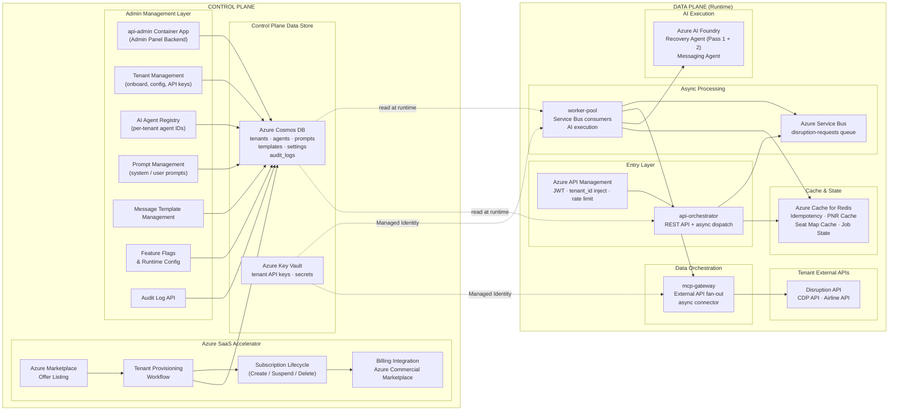

---

## 3. Async Runtime Flow

> Core request lifecycle. The hot path returns immediately (202 Accepted). AI execution happens asynchronously in the worker pool.

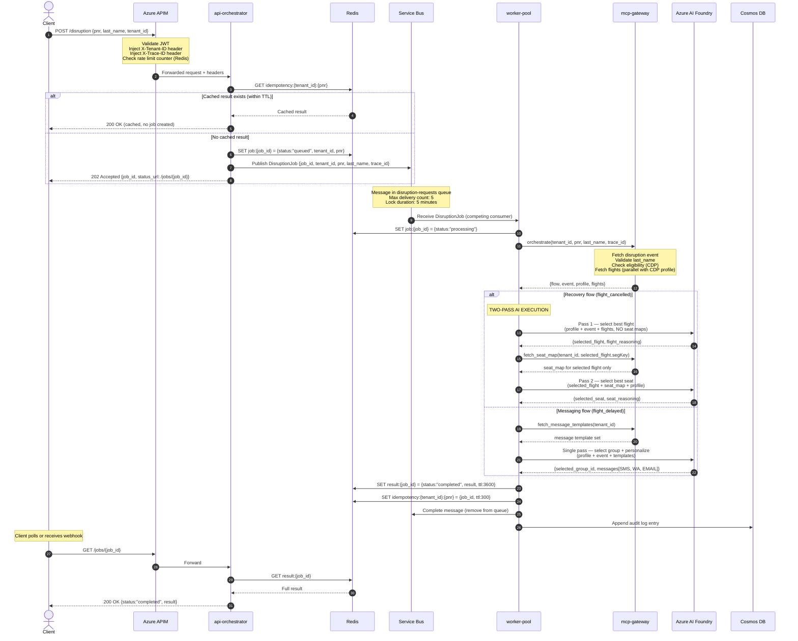

---

## 4. Recovery Flow Redesign — Two-Pass AI

> Key architectural change: seat maps are fetched ONLY for the AI-selected flight. Eliminates redundant API calls for N-1 flights and reduces token usage by removing unused seat data from the agent context.

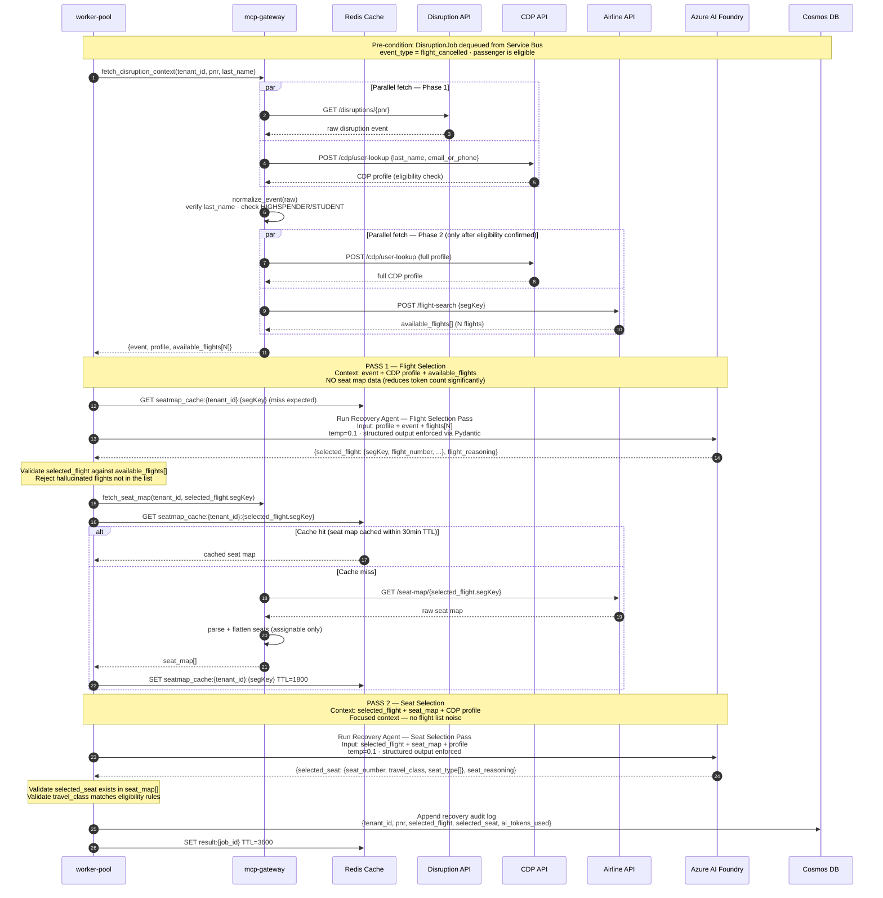

**Key changes from AS-IS:**
- Seat maps fetched for **1 flight** (selected by AI) vs previously **N flights** (all available)
- Two separate AI passes with focused context windows
- Pydantic validation on AI output with hallucination guard (validates flight exists in list)
- Seat map cached in Redis (30-min TTL) — subsequent requests for same flight skip the Airline API
- AI token usage reduced proportionally to number of available flights (typically 5–10x reduction)

---

## 5. Messaging Flow Redesign

> Async delay notification flow. All external calls happen in the Worker. Single AI pass selects persona and personalizes all channel messages.

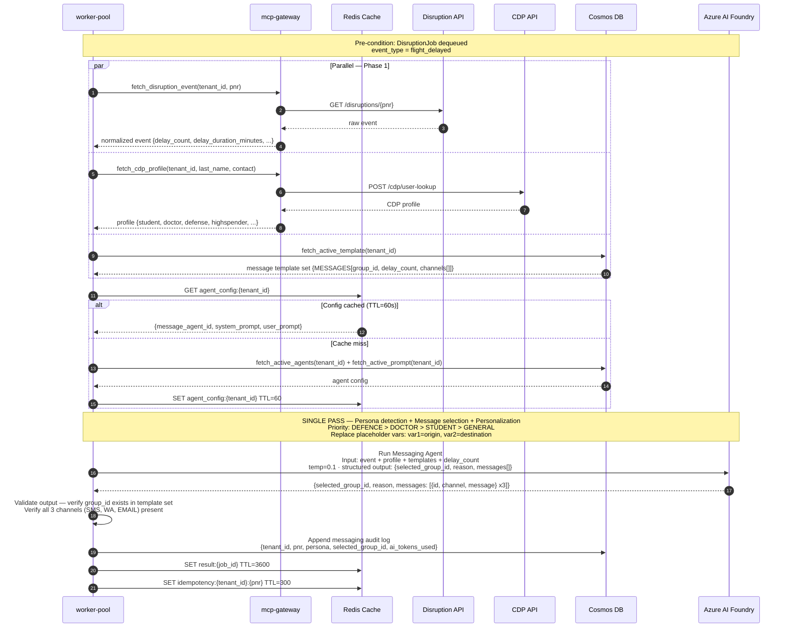

---

## 6. Redis + Service Bus Architecture

> Detailed view of the cache key schema, Service Bus topology, and job state machine.

```mermaid
flowchart TB
    subgraph SB_TOPOLOGY["AZURE SERVICE BUS TOPOLOGY"]
        direction LR
        subgraph QUEUES["Queues"]
            Q_MAIN["disruption-requests\n(main queue)\nMax delivery: 5\nLock: 5min\nTTL: 7 days"]
            Q_RETRY["disruption-retry\n(delayed retry queue)\nBackoff: 30s · 2min · 10min\nMax retries: 3"]
            Q_DLQ["disruption-requests/$DeadLetterQueue\n(DLQ)\nManual investigation\nAlert on depth > 10"]
        end
        subgraph TOPICS["Topics (future)"]
            T_COMPLETE["disruption-completed\n(completion events)\nSubscriptions: webhook-relay · analytics"]
        end
        Q_MAIN -->|"delivery count > 5"| Q_DLQ
        Q_MAIN -->|"transient failure"| Q_RETRY
        Q_RETRY -->|"after backoff delay"| Q_MAIN
    end

    subgraph REDIS_SCHEMA["REDIS KEY SCHEMA"]
        direction TB
        subgraph IDEM["Idempotency (TTL: 300s)"]
            K_IDEM["idem:{tenant_id}:{pnr}\n→ {job_id, cached_at}"]
        end
        subgraph JOBS["Job State (TTL: 3600s)"]
            K_JOB["job:{job_id}\n→ {status, tenant_id, pnr, created_at}\nstatus: queued → processing → completed | failed"]
        end
        subgraph RESULTS["Results (TTL: 3600s)"]
            K_RESULT["result:{job_id}\n→ full response JSON"]
        end
        subgraph CACHES["API Response Caches"]
            K_PNR["pnr:{tenant_id}:{pnr}\n→ normalized disruption event (TTL: 300s)"]
            K_SEATMAP["seatmap:{tenant_id}:{segKey}\n→ parsed seat list (TTL: 1800s)"]
            K_AGCFG["agent_config:{tenant_id}\n→ {agent_ids, prompts} (TTL: 60s)"]
            K_TENANT["tenant_cfg:{tenant_id}\n→ {flight_api, cdp_api, disrupt_api} (TTL: 300s)"]
        end
        subgraph RATE["Rate Limiting (sliding window)"]
            K_RATE["rl:{tenant_id}:{window_ts}\n→ request count\nEvaluated by Lua script in APIM"]
        end
    end

    subgraph JOB_STATE["JOB STATE MACHINE"]
        S_QUEUED["QUEUED\n(published to SB)"]
        S_PROC["PROCESSING\n(worker picked up)"]
        S_COMP["COMPLETED\n(result in Redis)"]
        S_FAIL["FAILED\n(moved to DLQ)"]
        S_CACHED["SERVED FROM CACHE\n(idempotency hit)"]

        S_QUEUED --> S_PROC
        S_PROC --> S_COMP
        S_PROC -->|"transient error\n< 5 attempts"| S_QUEUED
        S_PROC -->|"permanent error\nor > 5 attempts"| S_FAIL
        S_CACHED -..->|"bypasses all"| S_COMP
    end
```

---

## 7. AI Orchestration Architecture

> Per-tenant agent isolation, structured output validation, two-pass execution, fallback, and AI audit logging.

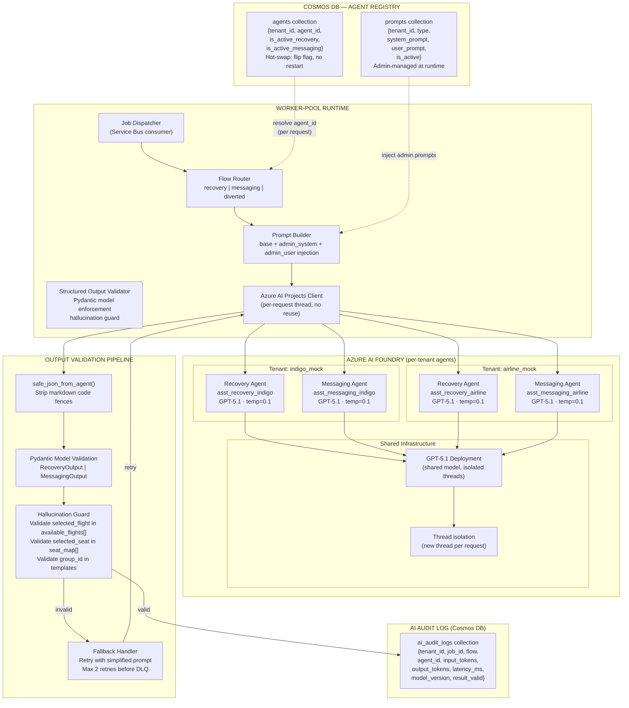

---

## 8. Security Architecture

> Trust boundaries, network isolation, identity, secrets management, and audit.

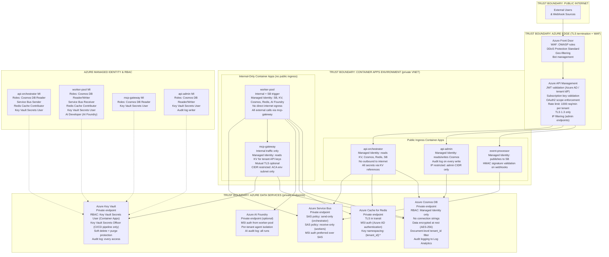

---

## 9. Observability Architecture

> End-to-end distributed tracing, AI-specific telemetry, metrics, alerting, and operational dashboards.

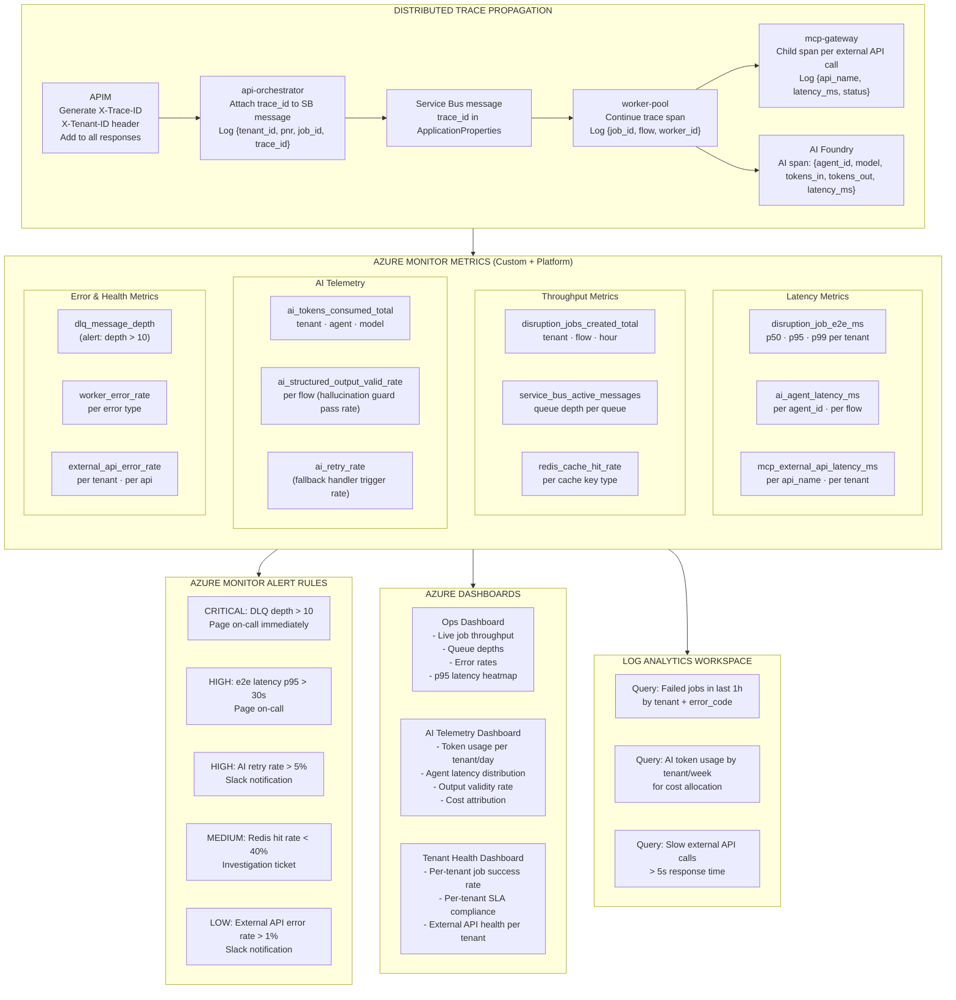

---

## 10. Container Apps Deployment Topology

> Explicit mapping of every Container App, its resources, scaling rules, and network configuration.

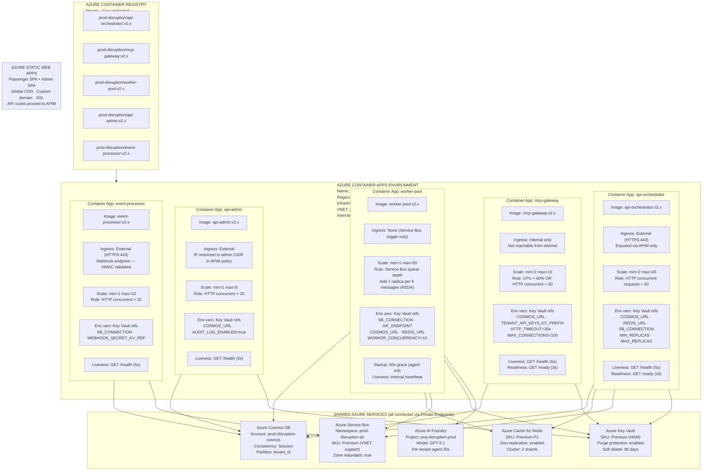

---

## 11. Multi-Region Architecture

> Active-active deployment across two Azure regions with Azure Front Door for global traffic routing, failover, and latency-based routing.

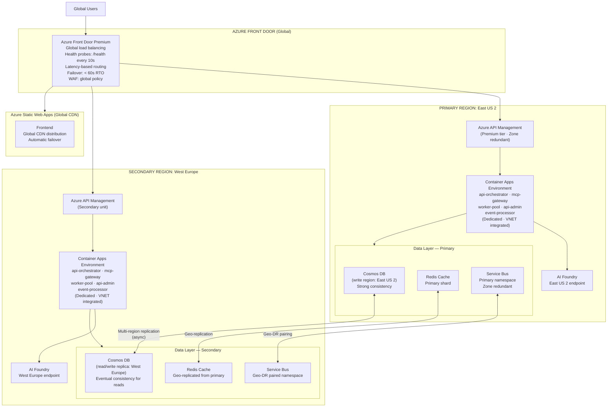

**RTO/RPO targets:**
- RTO: < 60 seconds (Front Door health probe failover)
- RPO: < 5 seconds (Cosmos DB async replication lag)
- Reads: served from nearest region (eventual consistency acceptable for config reads)
- Writes: Primary region only for job creation; secondary can serve reads and polling

---

## 12. Multi-Tenant Isolation Architecture

> How tenant isolation is enforced at every layer of the platform.

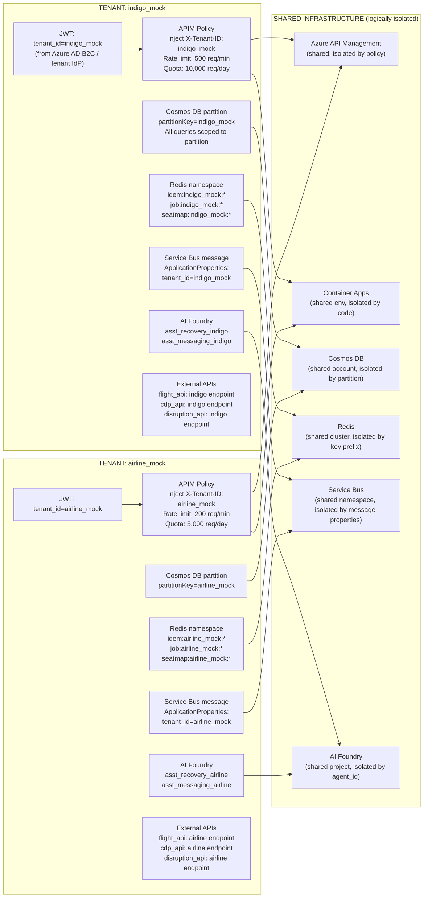

**Isolation matrix:**

| Layer | Mechanism | Shared? |
|---|---|---|
| API Management | JWT claim `tenant_id`, rate limit per tenant | Shared gateway, isolated policies |
| Container Apps | `X-Tenant-ID` header, no shared state | Shared process, isolated execution context |
| Redis | Key prefix `{tenant_id}:*` | Shared cluster |
| Service Bus | `tenant_id` in ApplicationProperties | Shared namespace |
| Cosmos DB | Partition key = `tenant_id` | Shared account, isolated partition |
| AI Foundry | Per-tenant `agent_id` resolved at runtime | Shared model deployment, isolated threads |
| External APIs | Per-tenant base URLs from Cosmos DB | Fully isolated |

---

## 13. DevOps / CI-CD Architecture

> GitHub Actions pipeline, container image lifecycle, blue-green deployments, and secret rotation.

```mermaid
flowchart LR
    subgraph SOURCE["SOURCE CONTROL"]
        GITHUB["GitHub Repository\nprod-disruption/platform\nBranch strategy:\nmain · develop · feature/*\nrelease/*"]
        GH_PR["Pull Request\nRequired reviewers: 2\nStatus checks: lint · test · security scan"]
    end

    subgraph CI["CONTINUOUS INTEGRATION (GitHub Actions)"]
        direction TB
        CI_LINT["Lint & Format\nruff · black · mypy"]
        CI_TEST["Unit & Integration Tests\npytest · coverage > 80%\nMock Service Bus + Redis"]
        CI_SECURITY["Security Scan\nbandit · pip-audit\nGitHub Advanced Security\nSecret detection"]
        CI_BUILD["Docker Build\nMulti-stage build\nNon-root user\nMinimal base image"]
        CI_PUSH["Push to ACR\nprod-disruption.azurecr.io\nTag: {service}:{sha} + {service}:latest"]
        CI_SCAN["Container Scan\nMicrosoft Defender for Containers\nBlock on HIGH/CRITICAL CVE"]
    end

    subgraph CD_STAGING["CD — STAGING"]
        STG_DEPLOY["Deploy to Staging\nContainer App revision\naz containerapp update --image"]
        STG_SMOKE["Smoke Tests\nPOST /disruption (mock tenant)\nGET /health (all 5 apps)\nRedis connectivity\nService Bus connectivity"]
        STG_APPROVE["Manual Approval Gate\nRequired: 1 approver\n(GitHub Environment Protection)"]
    end

    subgraph CD_PROD["CD — PRODUCTION (Blue-Green)"]
        PROD_REVISION["New Container App Revision\n(inactive, 0% traffic)"]
        PROD_VERIFY["Revision Smoke Test\nInternal health probe\nGET /health → 200"]
        PROD_SHIFT["Traffic Split\n10% → 50% → 100%\nMonitor error rate at each step\nAuto-rollback if error rate > 1%"]
        PROD_CLEANUP["Deactivate Old Revision\nAfter 30 min 100% traffic\nKeep 1 previous for rollback"]
    end

    subgraph SECRET_ROT["SECRET ROTATION"]
        KV_ROT["Key Vault Rotation Policy\nCosmos DB key: 90 days\nRedis key: 90 days\nSB SAS: 30 days\n(MSI preferred, SAS as fallback)"]
        CA_RELOAD["Container App auto-reload\nKV secret version pinned\nApp restart on new version"]
    end

    subgraph OBS_CD["DEPLOYMENT OBSERVABILITY"]
        DEPLOY_MARKER["Deployment Annotation\nApplication Insights\nMarks release in metrics graphs"]
        DEPLOY_ALERT["Post-deploy Alert Silence\n15 min grace period\nThen re-enable all alerts"]
    end

    GITHUB --> GH_PR --> CI_LINT
    CI_LINT --> CI_TEST --> CI_SECURITY --> CI_BUILD --> CI_PUSH --> CI_SCAN
    CI_SCAN --> STG_DEPLOY --> STG_SMOKE --> STG_APPROVE
    STG_APPROVE --> PROD_REVISION --> PROD_VERIFY --> PROD_SHIFT --> PROD_CLEANUP
    PROD_SHIFT --> DEPLOY_MARKER --> DEPLOY_ALERT
    KV_ROT --> CA_RELOAD
```

---

## Azure SaaS Accelerator Integration

> Tenant lifecycle managed through Azure Marketplace and the SaaS Accelerator. Each airline onboards as a SaaS subscriber.

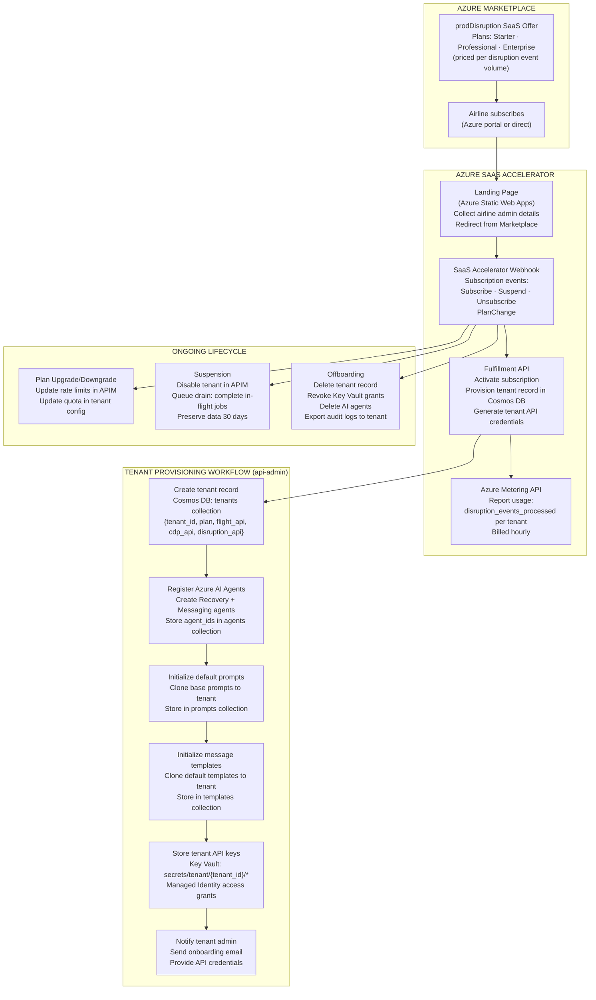

---

## Migration Path: AS-IS → TO-BE

| Phase | Scope | Key Change |
|---|---|---|
| **Phase 1** (2 weeks) | Fix critical bugs | BUG-001 `tenant_id` in `validate_request()`, BUG-002 `httpx` in requirements |
| **Phase 2** (4 weeks) | Containerize + ACR | Dockerfiles for all 5 services, push to ACR, deploy to ACA dev env |
| **Phase 3** (6 weeks) | Async refactor | Add Service Bus, decouple AI execution from hot path, implement job polling |
| **Phase 4** (4 weeks) | Redis layer | Idempotency, seat map cache, agent config cache, rate limiting |
| **Phase 5** (4 weeks) | Security hardening | Managed Identity, Key Vault, private endpoints, remove all hardcoded secrets |
| **Phase 6** (4 weeks) | Observability | App Insights correlation, custom metrics, dashboards, alerts |
| **Phase 7** (6 weeks) | Two-pass AI + validation | Recovery flow redesign, Pydantic validation, hallucination guard |
| **Phase 8** (4 weeks) | Multi-tenancy | Per-tenant agents, Redis namespacing, Cosmos DB partition validation |
| **Phase 9** (6 weeks) | SaaS Accelerator | Marketplace offer, tenant onboarding automation, metering |
| **Phase 10** (4 weeks) | Multi-region | Secondary region deployment, Front Door routing, geo-replication |
