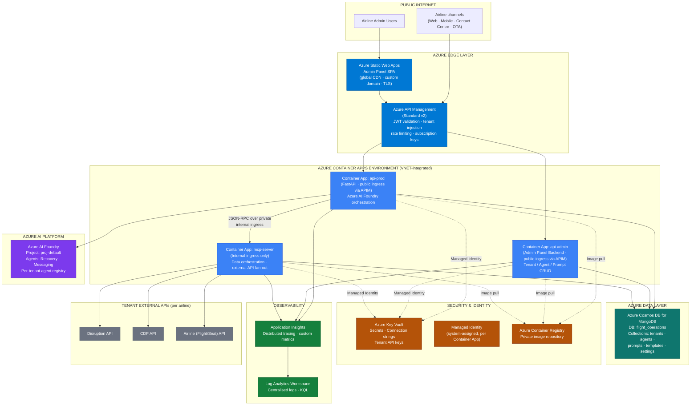
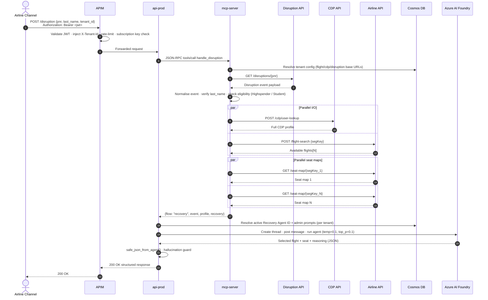
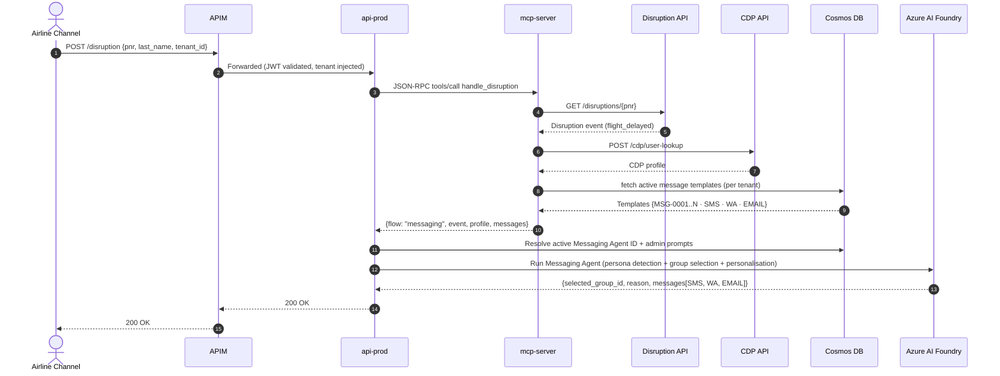
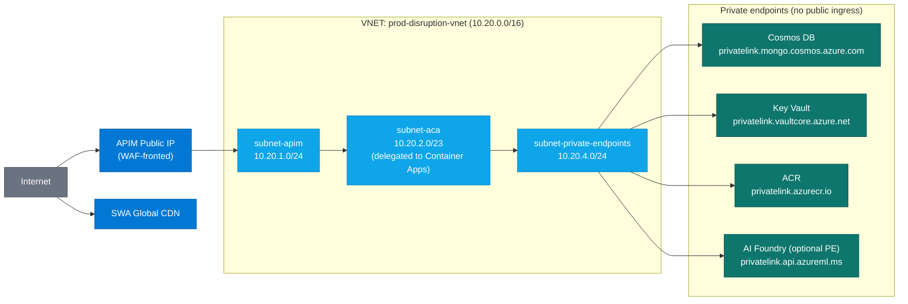
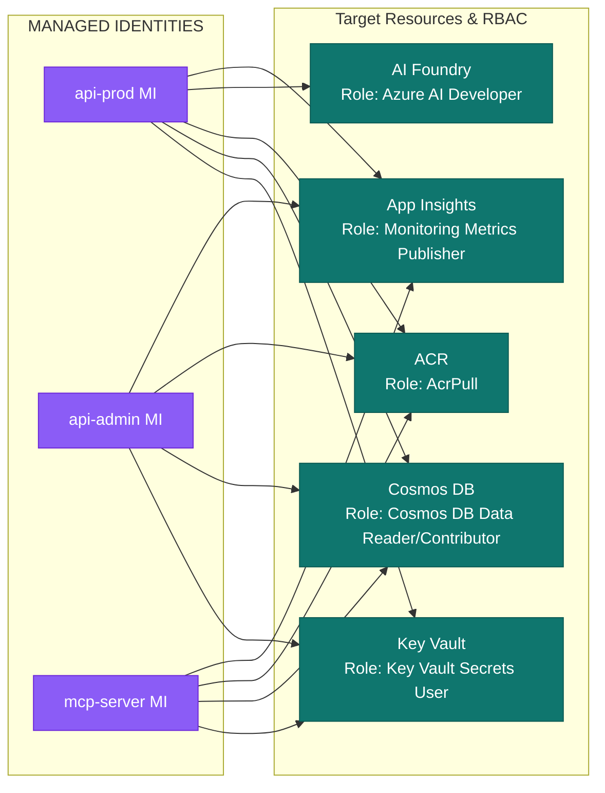
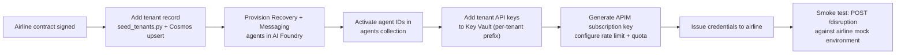
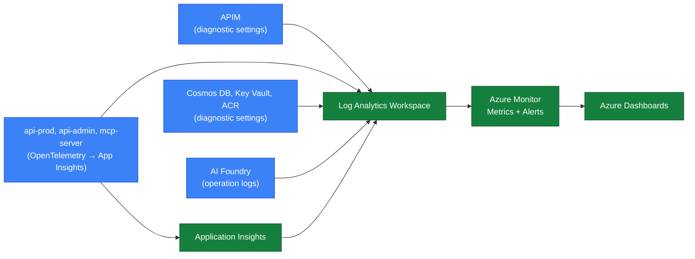
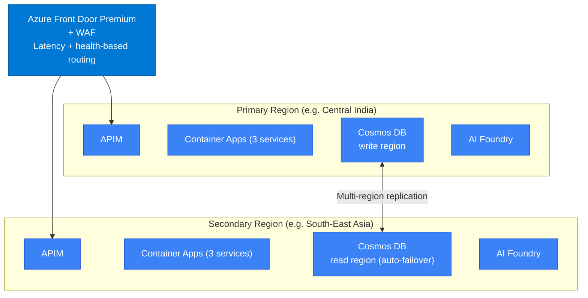

# prodDisruption — Production Architecture

> **Audience:** Microsoft Azure Architecture Review Team, internal platform engineering, partner architects.
> **Status:** Production (currently deployed). Forward-looking enhancements are tracked in `docs/future-architecture.md`.
> **Owner:** AIONOS Platform Engineering · rishabh.raizada@aionos.ai

---

## 1. Executive Summary

**prodDisruption** is a multi-tenant, AI-driven flight disruption management SaaS platform built natively on Microsoft Azure. When an airline passenger's flight is cancelled or delayed, the platform:

1. Ingests the disruption event from the airline's operational systems,
2. Resolves the passenger's persona via the airline's Customer Data Platform (CDP),
3. Invokes a tenant-scoped **Azure AI Foundry** agent to either re-accommodate the passenger (cancellation) or generate personalised multi-channel notifications (delay), and
4. Returns a deterministic, structured JSON response to the airline's downstream channels (web, mobile, contact centre, OTAs).

The platform is deployed as **three Azure Container Apps** behind **Azure API Management**, with a **Static Web App** front-end for tenant administration. All secrets and credentials are managed via **Azure Key Vault** with **Managed Identity** authentication end-to-end. Tenant configuration, AI agent registry, prompts and templates are stored in **Azure Cosmos DB (MongoDB API)** and are hot-swappable without redeployment.

| Dimension | Value |
|---|---|
| Cloud | Microsoft Azure (single subscription, single tenant per deployment) |
| Compute | Azure Container Apps (3 services) + Azure Static Web Apps |
| Edge | Azure API Management (Standard v2) |
| AI Runtime | Azure AI Foundry — GPT-class agents (Recovery + Messaging) |
| Data Plane | Azure Cosmos DB for MongoDB (vCore / RU mode — configurable) |
| Secrets | Azure Key Vault (Standard) + Managed Identity (system-assigned) |
| Tenancy | Logical multi-tenant — partition by `tenant_id` |
| Compliance posture | Aligned with Azure Well-Architected Framework — Security, Reliability, Operational Excellence, Performance, Cost |

---

## 2. Business Context

| Stakeholder | Outcome |
|---|---|
| Airline passengers | Sub-minute, personalised recovery (alternate flight + seat) or proactive delay notifications |
| Airline operations | Automation of disruption recovery; reduction in OPS call-centre load |
| Airline marketing / CRM | Persona-aware messaging (Student, Doctor, Defence, High Spender, General) |
| Airline IT | Drop-in SaaS — no on-premise AI infrastructure; standards-based REST API |
| AIONOS (vendor) | Multi-tenant SaaS economics on Azure; per-tenant isolation and metering |

**Disruption flows currently supported in production:**

1. **Recovery flow** — `event_type = flight_cancelled` → AI selects best alternate flight + best seat.
2. **Messaging flow** — `event_type = flight_delayed` → AI selects best message group + personalises SMS / WhatsApp / Email.

Future flow (planned): `flight_diverted` — see `docs/future-architecture.md`.

---

## 3. Logical Architecture

### 3.1 Component map (deployed today)



### 3.2 Component responsibilities

| Component | Type | Responsibility | Ingress |
|---|---|---|---|
| **Admin SPA** | Azure Static Web Apps | Airline admin UI for tenant config, agent registry, prompt and template management | Public (HTTPS, custom domain) |
| **APIM** | Azure API Management (Standard v2) | Single entry point, JWT auth, tenant context injection (`X-Tenant-Id`), rate limiting, subscription key, request/response logging, schema validation | Public (HTTPS) |
| **api-prod** | Azure Container Apps | Public REST API. Receives disruption requests, orchestrates MCP call, executes Azure AI Foundry agent run, returns structured response | Internal — APIM only |
| **api-admin** | Azure Container Apps | Backend for the Admin SPA. CRUD on tenants, agents, prompts, templates in Cosmos DB. Writes audit logs | Internal — APIM only |
| **mcp-server** | Azure Container Apps | Data orchestration. Parallel async fan-out to Disruption API, CDP API and Airline API. Tenant config resolution from Cosmos DB | Internal — VNET only (not reachable from internet) |
| **AI Foundry** | Azure AI Foundry | Hosts Recovery Agent and Messaging Agent. Per-tenant agent IDs resolved at runtime from Cosmos DB | Private (MI-authenticated) |
| **Cosmos DB (MongoDB API)** | Azure Cosmos DB | System of record for tenant config, agent registry, prompts, templates, settings, audit logs | Private endpoint |
| **Key Vault** | Azure Key Vault | Centralised secrets store. All Container Apps read via Key Vault references (no plaintext secrets) | Private endpoint |
| **ACR** | Azure Container Registry | Signed, scanned container images for all three apps | Managed Identity image pull |
| **Application Insights / LAW** | Azure Monitor | Distributed tracing, custom metrics, log aggregation, alerting | n/a |

---

## 4. Runtime Flows

### 4.1 Recovery flow (cancelled flight)



### 4.2 Messaging flow (delayed flight)



---

## 5. Azure Service Inventory (SKUs)

| Service | SKU / Tier | Rationale |
|---|---|---|
| Azure API Management | Standard v2 (Stv2) | Production multi-tenant ingress, VNET integration, subscription keys, JWT validation, ~5K req/s headroom |
| Azure Container Apps | Consumption + Dedicated (D4) workload profile | Per-app autoscaling; Dedicated profile for VNET integration and predictable cost on `mcp-server` |
| Azure Static Web Apps | Standard | Custom domain, SSO with Entra ID, staging environments |
| Azure Cosmos DB for MongoDB | vCore (M30) **or** RU-based (autoscale 1K–10K RU/s) | Predictable cost at scale (vCore) or true elastic (RU); session consistency |
| Azure AI Foundry | Standard project | Hosts persistent assistants (Recovery + Messaging); per-tenant agent IDs |
| Azure Key Vault | Standard | Secrets only; HSM tier not required at current data classification |
| Azure Container Registry | Premium | Geo-replication, content trust, private endpoint, Defender for Containers scanning |
| Application Insights | Workspace-based (LAW) | Distributed tracing, custom metrics, KQL across all 3 apps |
| Log Analytics Workspace | Pay-as-you-go (commit if > 100 GB/day) | Central log sink + diagnostic settings for every Azure resource |
| Azure Monitor | n/a | Metric alerts, action groups, dashboards |
| Microsoft Defender for Cloud | Defender for Containers + Defender for Key Vault + Defender for Cosmos DB | Continuous posture management and runtime threat detection |
| Azure DDoS Protection | Network Protection (Standard) | Applied at the APIM public IP / Front Door tier |

---

## 6. Network Architecture

### 6.1 Topology



### 6.2 Network controls

- **APIM** deployed in `External` mode in `subnet-apim` — only egress permitted is to `subnet-aca`.
- **Container Apps Environment** is **VNET-integrated** in `subnet-aca`. `mcp-server` uses `internal-only` ingress and is not addressable from outside the VNET.
- **All PaaS data services** (Cosmos DB, Key Vault, ACR) are accessed via **Private Endpoints**. Public network access is **disabled** on every account.
- **Egress to tenant external APIs** is routed through the Container Apps environment NAT — a fixed outbound public IP is registered with each airline tenant for IP allow-listing.
- **NSGs** on each subnet enforce least-privilege L4 rules. APIM → ACA on 443 only; ACA → private endpoints on 443/10250/27017.

---

## 7. Identity & Access (Zero-Trust)



| Principle | Implementation |
|---|---|
| **No secrets in code or env** | Every secret is a Key Vault reference: `secretref:` in Container Apps. Rotated via Key Vault rotation policies. |
| **Managed Identity everywhere** | All inter-service calls authenticate with system-assigned MI. No SAS tokens, no connection strings in app config. |
| **RBAC, least privilege** | Each app's MI has the minimum role required (e.g. `mcp-server` is `Cosmos DB Data Reader`, not Contributor). |
| **JWT at the edge** | APIM validates JWTs issued by Entra ID (airline tenant IdP federated where applicable). Claims drive `X-Tenant-Id` injection. |
| **Admin Panel SSO** | SWA uses Entra ID; admin roles enforced both in SWA route config and in the `api-admin` backend. |
| **Audit logging** | Every admin write produces an audit log entry in Cosmos DB. Diagnostic settings on Key Vault and Cosmos DB stream to Log Analytics. |

---

## 8. Data Architecture

### 8.1 Cosmos DB collections (database `flight_operations`)

| Collection | Purpose | Partition key | Indexed fields |
|---|---|---|---|
| `tenants` | Per-tenant base URLs and metadata | `tenant_id` | `tenant_id`, `is_active` |
| `agents` | AI Foundry agent IDs per tenant + flow + active flag | `tenant_id` | `tenant_id`, `flow`, `is_active` |
| `prompts` | System / user prompt overrides per tenant + flow | `tenant_id` | `tenant_id`, `flow`, `is_active` |
| `templates` | Message templates per tenant (delay flow) | `tenant_id` | `tenant_id`, `is_active` |
| `settings` | Generic runtime settings | `tenant_id` | `tenant_id` |
| `audit_logs` | Admin write audit trail | `tenant_id` | `tenant_id`, `timestamp` |

### 8.2 Data classification and residency

| Data class | Examples | Residency | Retention |
|---|---|---|---|
| Tenant config | Base URLs, agent IDs, prompts, templates | Primary Azure region (tenant-selected) | Lifetime of tenant |
| PII (transient) | PNR, last name, contact (in request body only) | Never persisted by prodDisruption; held in memory for the duration of the request | None (no PII written to Cosmos) |
| Audit logs | Admin actions | Same region as tenant | 365 days (configurable) |
| Telemetry | Request traces, AI token counts | Same region as tenant | 30 days hot / 90 days archive |

**Important guarantee:** prodDisruption does not persist passenger PII. All PII data flows through `mcp-server` in-memory only and is discarded after the response is returned.

### 8.3 Consistency & backup

- **Consistency:** Session consistency (per-tenant partition reads are read-your-writes).
- **Backup:** Continuous backup (point-in-time restore, 30-day window).
- **Geo-replication:** Single-region today; secondary read region planned (see §13).

---

## 9. AI Architecture

### 9.1 Agent registry & per-tenant isolation

```mermaid
flowchart TB
    classDef tenant fill:#0ea5e9,stroke:#0284c7,color:#fff
    classDef agent fill:#7c3aed,stroke:#5b21b6,color:#fff
    classDef model fill:#22c55e,stroke:#15803d,color:#fff
    classDef cosmos fill:#0f766e,stroke:#0d5c55,color:#fff

    subgraph TA["Tenant: indigo_mock"]
        TA_R["Recovery Agent<br/>asst_recovery_indigo"]:::agent
        TA_M["Messaging Agent<br/>asst_messaging_indigo"]:::agent
    end:::tenant

    subgraph TB2["Tenant: airline_mock"]
        TB_R["Recovery Agent<br/>asst_recovery_airline"]:::agent
        TB_M["Messaging Agent<br/>asst_messaging_airline"]:::agent
    end:::tenant

    subgraph SHARED["Azure AI Foundry — proj-default"]
        MODEL["Shared model deployment<br/>(GPT-class, temp=0.1, top_p=0.1)"]:::model
        THREAD["Thread isolation<br/>New thread per request<br/>(no cross-request state)"]
    end

    REG["Cosmos DB · agents collection<br/>{tenant_id, flow, agent_id, is_active}"]:::cosmos

    REG -. resolved per request .-> TA_R
    REG -. resolved per request .-> TA_M
    REG -. resolved per request .-> TB_R
    REG -. resolved per request .-> TB_M

    TA_R & TA_M & TB_R & TB_M --> MODEL
    MODEL --> THREAD
```

### 9.2 Agent execution contract

| Property | Value |
|---|---|
| SDK | `azure-ai-projects` + `azure-ai-agents` |
| Authentication | `DefaultAzureCredential` (Managed Identity in production, CLI fallback locally) |
| Temperature / top_p | Fixed at `0.1 / 0.1` (deterministic) |
| Thread lifecycle | Created per request, never reused |
| Timeout | 120s polling window |
| Output parsing | `safe_json_from_agent()` strips markdown fences and validates JSON shape |
| Hot-swap | New agent ID activated in Cosmos DB `agents` collection — picked up on next request, no app restart |
| Prompt layering | Base prompt (in `api-prod`) → admin system prompt prepended → admin user prompt appended |

### 9.3 Token economics

- **Recovery flow:** scales with number of available flights × seats per flight.
- **Messaging flow:** scales with size of the template set per tenant.
- **Reduction roadmap (see future-architecture.md):** Two-pass recovery (select flight first, fetch seat map only for that flight) → 5–10× token reduction.

---

## 10. Multi-Tenancy Model

| Layer | Isolation mechanism | Shared infra? |
|---|---|---|
| APIM | JWT `tenant_id` claim → `X-Tenant-Id` header injection · per-tenant rate limit and quota policies | Shared gateway |
| Container Apps | Tenant context flows in headers; no in-memory tenant state | Shared compute |
| MCP server | `tenant_id` is the resolver key for every external API base URL | Shared compute |
| Cosmos DB | Partition key = `tenant_id` on every collection; queries always scoped | Shared account, isolated partitions |
| Key Vault | Per-tenant secret naming convention: `tenants/{tenant_id}/{secret_name}` | Shared vault |
| AI Foundry | Distinct `agent_id` per tenant per flow; thread isolation enforced by SDK | Shared project, isolated agents |
| External APIs | Per-tenant base URLs resolved from `tenants` collection | Fully isolated per airline |

### 10.1 Tenant onboarding (operational)



---

## 11. Observability

### 11.1 Telemetry pipeline



### 11.2 Custom telemetry

| Metric | Dimensions | Purpose |
|---|---|---|
| `disruption_request_latency_ms` | `tenant_id`, `flow`, `outcome` | SLO tracking |
| `ai_agent_run_latency_ms` | `tenant_id`, `flow`, `agent_id` | AI performance |
| `ai_tokens_consumed` | `tenant_id`, `flow`, `direction` | Cost attribution |
| `mcp_external_api_latency_ms` | `tenant_id`, `api_name` | Airline-side performance |
| `disruption_request_total` | `tenant_id`, `flow`, `status` | Throughput + error rate |

### 11.3 Alerts (initial production set)

| Severity | Condition | Action |
|---|---|---|
| Sev 1 | `api-prod` 5xx rate > 5 % for 5 min | Page on-call |
| Sev 1 | AI Foundry timeout rate > 10 % for 5 min | Page on-call |
| Sev 2 | p95 e2e latency > 30 s for 10 min | Slack channel |
| Sev 2 | Cosmos DB throttling (429s) > 1 % | Slack channel |
| Sev 3 | Key Vault auth failure > 0 | Email |
| Sev 3 | External tenant API error rate > 1 % | Email tenant ops |

---

## 12. DevOps & Release Engineering

### 12.1 CI / CD pipeline

```mermaid
flowchart LR
    classDef ci fill:#3b82f6,stroke:#1d4ed8,color:#fff
    classDef cd fill:#7c3aed,stroke:#5b21b6,color:#fff

    GH["GitHub<br/>main + release branches"] --> LINT["Lint + type-check<br/>ruff · mypy"]:::ci
    LINT --> TEST["Unit + integration tests<br/>pytest"]:::ci
    TEST --> SEC["Security scan<br/>bandit · pip-audit · Defender"]:::ci
    SEC --> BUILD["Multi-stage Docker build<br/>distroless · non-root"]:::ci
    BUILD --> PUSH["Push to ACR<br/>tag = git SHA"]:::ci
    PUSH --> SCAN["Defender for Containers<br/>block on HIGH/CRITICAL"]:::ci

    SCAN --> STG["Deploy to Staging<br/>az containerapp update"]:::cd
    STG --> SMOKE["Smoke tests"]:::cd
    SMOKE --> APPR["Manual approval gate"]:::cd
    APPR --> PROD["Production blue/green<br/>(Container App revisions)"]:::cd
    PROD --> SHIFT["Traffic shift<br/>10 % → 50 % → 100 %"]:::cd
    SHIFT --> CLEAN["Deactivate old revision"]:::cd
```



### 12.2 Release patterns

- **Blue/green via Container App revisions** — new revision deployed with 0 % traffic, smoke tested, then shifted progressively.
- **Auto-rollback** — error-rate threshold of 1 % on the new revision triggers an automatic revert.
- **Hot-reload of AI config** — agent IDs, prompts and templates change in Cosmos DB without a code deploy.
- **Secret rotation** — Key Vault rotation policies regenerate Cosmos DB keys (90 days), tenant API keys (per tenant policy). Container Apps reload Key Vault references on rotation.

---

## 13. Reliability & Disaster Recovery

### 13.1 Current posture (single-region)

| Aspect | Current state |
|---|---|
| Region | One primary Azure region (e.g. `Central India` or `South India`) |
| HA within region | Container Apps revisions, min replicas ≥ 2, zone-redundant where the SKU supports it |
| Cosmos DB | Zone-redundant; continuous backup enabled (30-day PITR) |
| APIM | Standard v2 — zone-redundant |
| ACR | Premium with zone redundancy |
| Key Vault | Soft delete + purge protection enabled |
| RTO (region failure) | Manual failover today — target 60 min |
| RPO | ≤ 5 min (Cosmos continuous backup) |

### 13.2 Target multi-region posture (planned)



**Targets (multi-region):**

- **RTO < 60 s** via Front Door health-probe failover.
- **RPO < 5 s** via Cosmos DB multi-region async replication.
- **Writes** routed to primary; **reads + polling** can be served from either region.

---

## 14. Performance & Scaling

| Layer | Scaling rule | Floor / Ceiling |
|---|---|---|
| APIM | Fixed capacity units (Stv2); scaled manually based on RPS | 1 → 4 units |
| `api-prod` | HTTP concurrency-based autoscale (≈ 50 concurrent / replica) | 2 → 20 replicas |
| `api-admin` | HTTP concurrency-based | 1 → 5 replicas |
| `mcp-server` | CPU + HTTP concurrency | 2 → 10 replicas |
| Cosmos DB (RU mode) | Autoscale 1K → 10K RU/s per collection (adjust per workload) | n/a |
| Cosmos DB (vCore mode) | Vertical scale (M30 → M40) when sustained CPU > 60 % | n/a |
| AI Foundry | Quota-bounded; per-region TPM/RPM monitored | Negotiated quota |

**Hot-path budget (today, recovery flow, p95):**

| Stage | Budget |
|---|---|
| APIM | < 50 ms |
| MCP fan-out (parallel) | < 4 s (dominated by airline APIs) |
| AI Foundry recovery run | < 15 s |
| Total e2e | < 20 s p95 |

---

## 15. Cost Model

| Driver | Notes |
|---|---|
| **AI Foundry tokens** | Dominant variable cost. Tracked per `tenant_id` via custom telemetry. Two-pass recovery (planned) reduces this 5–10×. |
| **Container Apps** | Largely pay-per-vCPU-second + memory-second. `mcp-server` typically the largest as it does parallel I/O. |
| **Cosmos DB** | RU mode for low/burst tenants; vCore for predictable steady-state. Monitor RU consumption per partition. |
| **APIM Standard v2** | Fixed unit cost; scale units up only when sustained RPS warrants it. |
| **Egress to tenant APIs** | Negligible at current volumes; monitor as multi-region rolls out. |
| **Observability** | Log Analytics ingestion is the main lever — set per-table retention and sample non-error traces. |

**Per-tenant attribution:** All custom metrics are tagged with `tenant_id`. Cost dashboards aggregate by tag for chargeback / showback.

---

## 16. Security Controls Summary

| Control family | Implementation |
|---|---|
| Network | VNET-integrated ACA; private endpoints for Cosmos, Key Vault, ACR; APIM is the only public ingress for API; SWA is the only public ingress for the Admin UI |
| Identity | System-assigned Managed Identity per Container App; RBAC at minimum role; no SAS / connection strings |
| Secrets | Key Vault only; references in Container Apps; soft delete + purge protection; rotation policies |
| Edge | APIM JWT validation, subscription keys, per-tenant rate limit, schema validation; (planned) Azure Front Door + WAF |
| Data | TLS 1.2+ in transit; Cosmos DB AES-256 at rest with Microsoft-managed keys (CMK upgrade available); no passenger PII persisted |
| Threat detection | Microsoft Defender for Containers, Defender for Cosmos DB, Defender for Key Vault, Defender CSPM |
| Compliance | Aligned to ISO 27001 / SOC 2 controls supplied by Azure; per-tenant audit logs |
| Vulnerability mgmt | ACR + Defender for Containers; CI gate on HIGH / CRITICAL CVEs |
| Supply chain | Multi-stage builds, distroless base image, non-root runtime, signed images (planned) |

---

## 17. Well-Architected Framework Alignment

| Pillar | Current state | Continuous-improvement actions |
|---|---|---|
| **Reliability** | Zone-redundant SKUs, ACA min replicas ≥ 2, Cosmos PITR, blue/green | Multi-region active/active; circuit breakers on tenant external APIs; Service Bus async hot path |
| **Security** | MI everywhere, Key Vault references, private endpoints, JWT at edge, Defender enabled | CMK on Cosmos DB; Front Door + WAF; signed images; tenant-scoped Key Vaults at scale |
| **Cost Optimisation** | Autoscale on all ACA; RU mode where bursty | Two-pass recovery (token reduction); reserved capacity for steady-state; LAW sampling |
| **Operational Excellence** | CI/CD with security gates; blue/green; custom telemetry | Production runbooks per alert; chaos drills; SLO error budgets per tenant |
| **Performance Efficiency** | Async fan-out in MCP, near-deterministic AI temp, parallel seat maps | Redis cache for seat maps + tenant config; two-pass recovery; AI streaming responses |

---

## 18. Open Items & Forward Roadmap

These items are tracked in `docs/future-architecture.md` and `docs/roadmap.md`. They are non-blocking for current production; sequencing is driven by traffic growth and contractual SLAs.

| Theme | Description | Trigger |
|---|---|---|
| **Async hot path** | Introduce Service Bus + worker pool to decouple AI execution from request lifecycle | When p95 latency > 20 s sustained or AI quota becomes the bottleneck |
| **Redis cache** | Idempotency, seat map cache, tenant config cache, agent config cache | When repeat-PNR rate > 5 % or seat map fetch dominates latency |
| **Two-pass recovery** | AI selects flight first; fetch seat map only for chosen flight | Always — token-cost win |
| **Pydantic + hallucination guard** | Strict structured-output validation with retry path | Before opening to a third tenant |
| **Multi-region active/active** | Front Door + paired regions + Cosmos multi-region writes | When the first contractual RTO < 60 s is committed |
| **SaaS Accelerator + Marketplace** | Self-serve tenant onboarding, metered billing | When > 5 tenants or Marketplace listing is required |
| **Per-tenant Key Vault** | One vault per tenant for high-isolation customers | On enterprise contract requirement |
| **Event ingestion (`event-processor`)** | Airline webhook ingestion for proactive disruption detection | When airlines provide push events instead of poll |

---

## 19. Glossary

| Term | Definition |
|---|---|
| **PNR** | Passenger Name Record — the booking identifier |
| **segKey** | Segment key — uniquely identifies a flight segment, used for flight search and seat maps |
| **CDP** | Customer Data Platform — airline-owned profile / persona store |
| **MCP** | Model Context Protocol — JSON-RPC contract used between `api-prod` and `mcp-server` |
| **Persona** | CDP-derived passenger category: Student, Doctor, Defence, High Spender, General |
| **Recovery flow** | The cancellation-handling pipeline that selects an alternate flight + seat |
| **Messaging flow** | The delay-handling pipeline that produces personalised SMS / WhatsApp / Email |
| **Tenant** | A single airline customer of the platform (`tenant_id` is the partition key) |
| **AI Foundry** | Azure AI Foundry — hosts the Recovery and Messaging agents |

---

**Document version:** 1.0 · Production · 2026-05-25
**Next review:** Quarterly, or on any material architectural change
**Related documents:** `docs/architecture.md` (AS-IS detail), `docs/future-architecture.md` (TO-BE / vision), `docs/database.md`, `docs/api.md`, `docs/deployment.md`
